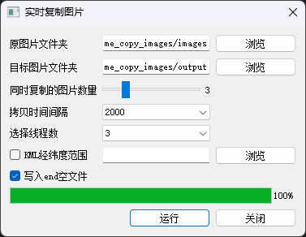

# Real-Time-Image-Copier
Real-Time Image Copier 是一个用于实时复制图像的工具。它支持多线程处理，并可以根据KML文件中的地理范围过滤图像。



## 功能

- **实时复制**：从源文件夹复制图像到目标文件夹。
- **多线程支持**：可以设置多个线程以提高复制速度。
- **KML地理过滤**：根据KML文件中的地理坐标过滤图像。
- **进度跟踪**：通过GUI界面显示复制进度。
- **可选的结束标志文件**：在复制完成后创建一个名为`end`的空文件。

## 文件结构

- `output/`：输出文件夹，用于存放复制后的图像。
- `images/`：存放测试数据的文件夹。
- `kml/`：存放测试images对应的范围文件。

## 安装

确保你已经安装了以下Python库：
```bash
pip install PyQt5 piexif pillow
```

## 使用方法

### 命令行

你可以通过命令行运行该程序：
```bash
python real_time_add_images.py --src_dir <源文件夹路径> --dst_dir <目标文件夹路径> --n <同时复制的图片数量> --t <时间间隔> --threads <线程数> --use_kml <是否使用KML> --kml_path <KML文件路径> --end <是否创建end文件>
```

### 图形用户界面

1. 运行 `real_time_copy_images_interface.py` 启动GUI界面。
2. 在界面中设置源文件夹、目标文件夹、复制数量、时间间隔、线程数等参数。
3. 点击“运行”按钮开始复制。

## 参数说明

- `--src_dir`：源图片文件夹路径。
- `--dst_dir`：目标图片文件夹路径。
- `--n`：需要同时复制的图片数量。
- `--t`：时间间隔（毫秒）。
- `--threads`：线程数。
- `--use_kml`：是否使用KML文件进行地理过滤。
- `--kml_path`：KML文件的路径。
- `--end`：是否在完成后创建一个名为`end`的空文件。

## 贡献

欢迎贡献代码！请提交Pull Request或报告问题。

## 许可证

该项目采用MIT许可证。详情请参阅LICENSE文件。

